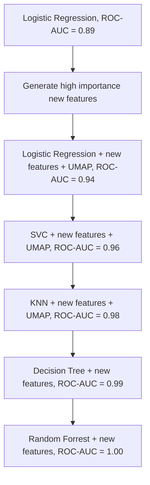



# **Values to Users**
    - New insightful features for better modeling
    - Progressive improvement of classification models
    - Non-linear dimensionality reduction
    - Interaction between categorical and numerical data

From this data challenge, you are supposed to go through the whole process of solve a clinical data classification problem, including how to apply data manipulation, how to do feature engineering, what model to choose and how to optimize the model. In the process of playing with the data, you would go through a latitudinal comparision of different classification models. You would also compare the non-linear and linear dimension reduction methods, and have a straightforward comprehension of when and how to use dimension reduction to optimize the model.

# **Enhancement Roadmap**

# **Data Set Information:**

This is a multivariate type of dataset which means providing or involving a variety of separate mathematical or statistical variables, multivariate numerical data analysis. It is composed of 14 attributes which are age, sex, chest pain type, resting blood pressure, serum cholesterol, fasting blood sugar, resting electrocardiographic results, maximum heart rate achieved, exercise-induced angina, oldpeak — ST depression induced by exercise relative to rest, the slope of the peak exercise ST segment, number of major vessels and Thalassemia. This database includes 76 attributes, but all published studies relate to the use of a subset of 14 of them. The Cleveland database is the only one used by ML researchers to date. One of the major tasks on this dataset is to predict based on the given attributes of a patient that whether that particular person has heart disease or not and other is the experimental task to diagnose and find out various insights from this dataset which could help in understanding the problem more.

**Business Problem:**

Create a model to classify features into the diagnosis of heart disease

**Model Type:**

Classification

**Feature Category:**

discrete, continuous, categorical

**Indenpendent Feature X:**
* age - Age of the patient in years

* sex - Male/Female

* chest_pain_type - typical angina, atypical angina, non-anginal, asymptomatic

* resting_blood_pressure - resting blood pressure in mm Hg on admission to the hospital

* cholestoral - serum cholesterol in mg/dl

* fasting_blood_sugar - if fasting blood sugar > 120 mg/dl

* Max_heart_rate - the maxium heart rate achieved during all the recording

* exercise_induced_angina - whether the subject has exercise induced angina(True/ False)

* oldpeak - ST depression induced by exercise relative to rest

* slope - the slope of the peak exercise ST segment

* vessels_colored_by_flourosopy - number of major vessels (0-3) colored by fluoroscopy

* thalassemia - diagnosis of Thalassemia (normal; fixed defect; reversible defect)

**Dependent Feature Y:**
* 'target' Tagged as 0=no heart disease; 1 = heart disease

# **Solution Overview**

## 1. Load Data
 Load and showcase Data

## 2. Data Inspection and Manipulation
### 2.1. Missing value

  

This part check whether there is any missing value in the dependent and independent feature. If so, the features with more than 20% missing value would be dropped. If the features are important (high information volumn, highly related to the dependent feature, etc.), there are several methods we could use, depending on the data and business problem:

  

1. **Imputation**: Fill the missing values with some value. The imputation strategy depends on the nature of the data:

  

- **Mean/Median/Mode Imputation**: Fill the missing values with the mean/median/mode of the column. Mean imputation is suitable for continuous data, while median and mode imputation are more robust for outliers and can be used for both continuous and categorical variables respectively.

  

- **Constant Value Imputation**: Fill the missing values with a constant value. This is typically done when you know the value that would be appropriate to fill, or for creating a special flag that identifies missingness.

  

- **Prediction Imputation**: Fill the missing values based on predictions from other data. This could involve training a machine learning model (like a linear regression, k-nearest neighbors, or decision tree) to predict the missing values.

  

2. **Last Observation Carried Forward (LOCF) or Next Observation Carried Backward (NOCB)**: This technique is mostly used for time-series data where missing values can be replaced by the last observed value or the next observed value respectively.

  

3. **Multivariate Imputation by Chained Equations (MICE)** or other advanced imputation methods: These techniques create multiple imputations for missing data, and can be a good solution when data is missing at random.

  

4. **Creating an indicator feature**: Create a new feature to indicate whether the data was missing for a particular observation, then fill the actual missing value with 0 or some other constant. This allows the model to account for the missingness of the variable.

### 2.2 Primary data encoding

The original data includes categorical data, and machine learning models usually only accept numerical inputs. Thus, we need encoding methods to transform the categorical data to numerical data.

  

**Two common methods:**

  

1. **One-Hot Encoding**: This is typically used for nominal categorical variables, where there is no inherent order in the categories. If a variable has n categories, one-hot encoding creates n binary variables, each representing a single category.

  

2. **Ordinal Encoding**: This is used for ordinal categorical variables, where there is a clear ordering of the categories (like "low", "medium", "high"). Ordinal encoding transforms the categories into numbers, preserving their order.

  

In this case, we apply ordinal encoding with *slope, vessels_colored_by_flourosopy, fasting_blood_sugar, rest_ecg*; one-hot encoding with *sex, chest_pain_type, exercise_induced_angina, thalassemia*.

  

## 3. Benchmark Solution
 Since the data are clean and of numeric type, Logistic regression training is directly used as the baseline. The ROC-AUC score with benchmark solution is 0.89

## 4. Feature Engineering
  Using existing data to create many new features have many benefits: Enhanced Model Performance,Better Representation of Data,Incorporation of Domain Knowledge,Reducing Feature Dimensionality,Improved Interpretability,Addressing Non-Linearity,Temporal and Spatial Insights.

## 5. Benchmark Model on Data with Feature Engineering

The Logistic Regression model, trained using data subjected to feature engineering, achieved an ROC-AUC score of 0.89. Despite the lack of a notable increase in the ROC-AUC score, the engineered features have high factor importance. Consequently, implementing feature selection or dimensionality reduction could be a viable strategy in this scenario.

## 6. Feature Selection with Lasso Regularization
For the benchmark solution Logistic Regression, if there is too much independent features, and exists collinearity, feature selection and data dimensionality reduction is necessary. Here we  introduce Lasso Regularization as the feature selection method. Lasso Regularization has the effect of pushing less important feature's coefficients towards zero, effectively performing feature selection. It works by adding a penalty equal to the absolute value of the magnitude of the coefficients to the loss function.

Lasso Regularization  is used to prevent overfitting, which happens when a model learns the training data too well and performs poorly when introduced to new, unseen data. It helps to create a balance between bias and variance, thereby creating models that generalize well to unseen data.

The ROC-AUC score of Logistic Regression with Lasso Regularization is 0.89, we would try nonlinear dimensionality reduction in next step.

## 7. Dimensionality reduction with non-linear dimension reduction method (UMAP)
Uniform Manifold Approximation and Projection (UMAP) is a nonlinear, advanced technique for dimensionality reduction. Developed with principles of Riemannian geometry and algebraic topology, UMAP excels in accurately representing complex, high-dimensional data in lower-dimensional space. It maintains both local and global data structures, unlike some techniques that prioritize local structures. This characteristic enhances UMAP's capability to reveal patterns and relationships within data. UMAP is compatible with diverse data types - from tabular to categorical and text data. It is also known for its scalability, effectively processing large datasets, and its computational efficiency. Despite being a stochastic algorithm, which may produce slightly different results across runs, UMAP is highly respected and widely used due to its versatility and performance in exploratory data analysis and machine learning tasks.

After the dimensionality reduction by UMAP, the ROC-AUC score of Logistic Regression increased from 0.89 to 0.94.

## 8.1 Model Enhancement - SVC
The Support Vector Classifier (SVC) is a powerful machine learning model, primarily used for classification tasks, that works by finding a hyperplane that best separates the classes in the feature space, while maximizing the margin between the classes.

SVC is more robust to high-dimensional data and outliers. It solve a quadratic programming problem to determine the decision boundary, and this results in finding a global optimum.Standardization should be used to unify the scale before apply SVC.

The ROC-AUC score of SVC with UMAP increased to 0.96.

## 8.2 Model Enhancement - KNN
The k-Nearest Neighbors method predicts the output of a new instance based on the majority class of its 'k' closest instances in the feature space. KNN is an instance-based, non-parametric learning algorithm, which means it does not make any underlying assumptions about the distribution of data. It uses the actual instances of the training dataset to make predictions.

Comparing to non-kernel SVC, KNN can handle non-linear decision boundaries naturally. Its decision boundaries are formed based on the local distribution of data points in the feature space. This could be advantageous when the relationship between features is complex and non-linear.

The ROC-AUC score of KNN with UMAP increased to 0.98.

## 8.3 Model Enhancement - Decision Tree
Decision Tree Classification is a type of supervised learning algorithm that uses a tree-like model of decisions and their possible consequences to predict the class of an instance based on its feature values.
It is not sensitive to the scale of the input features, and has parameters that are relatively easier to understand and tune.

The ROC-AUC score of Decision Tree increased to 0.99.

## 8.4 Model Enhancement - Random Forest
Random Forest is an ensemble machine learning algorithm that operates by constructing multiple decision trees at training time and outputting the class that is the mode of the classes or mean prediction of the individual trees for classification or regression tasks respectively. The ROC-AUC score of random forrest is 1.00.
